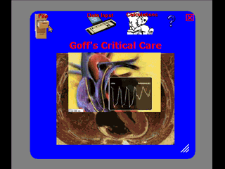



## Intensive Care \(ICU\) Medical Expert Utility

### Description

Update(7-20-2008):The program has been completed and now Interprets Hemodynamics, Arterial Blood Gases, Oxyhemoglobin dissociation curves, Oxygen dosage, Renal failure parameters and intravascular volume status, Directs Fluid challenges, Total Parenteral Nutrition, Calculates Resting Energy Expenditure from hemodynamic variables, Pharmacokinetic dosing of Aminoglycoside Antibiotics and Theophylline, Calculates Mechanical Ventilator values, Calculates Apache II mortality score and Glascow Coma Score. This program is for educational application only as it hasn't been tested completely in a clinical setting and errors may exist in the code....Medical expert program to interpret hemodynamic values obtained from a right heart catherization. Intensive Care Medicine, Critical Care. Ported from Palm operating system. Tabctl32.ocx can be downloaded here, if needed: www.moosenose.com/ICU-OCXs.zip
 
### More Info
 

             |
---                |---
**Submitted On**   |2008-07-20 06:09:22
**By**             |[Warren Goff](https://github.com/Planet-Source-Code/PSCIndex/blob/master/ByAuthor/warren-goff.md)
**Level**          |Intermediate
**User Rating**    |5.0 (20 globes from 4 users)
**Compatibility**  |VB 6\.0
**Category**       |[Complete Applications](https://github.com/Planet-Source-Code/PSCIndex/blob/master/ByCategory/complete-applications__1-27.md)
**World**          |[Visual Basic](https://github.com/Planet-Source-Code/PSCIndex/blob/master/ByWorld/visual-basic.md)
**Archive File**   |[Intensive\_2121177202008\.zip](https://github.com/Planet-Source-Code/warren-goff-intensive-care-icu-medical-expert-utility__1-68966/archive/master.zip)

